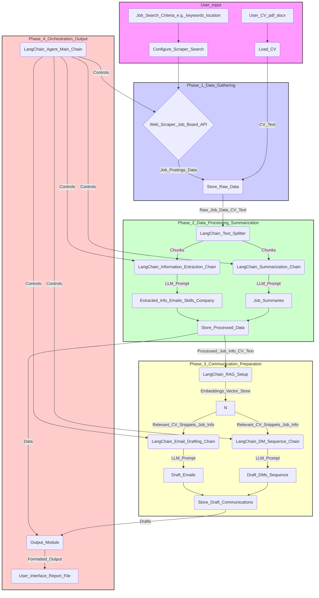

# LangChain Job Search Agent: Architecture Diagram (Conceptual)

This document provides a conceptual architecture diagram, described textually, for the LangChain-based job search agent. It illustrates the flow of data and the interaction between different components.

**Explanation of Components:**

1.  **User Input:**
    *   `User CV`: The user provides their Curriculum Vitae.
    *   `Job Search Criteria`: User specifies what kind of jobs to look for.
    *   `Load CV`: Uses LangChain `Document Loaders` to read the CV content.
    *   `Configure Scraper/Search`: Sets up the data gathering parameters.

2.  **Phase 1: Data Gathering:**
    *   `Web Scraper / Job Board API`: The module responsible for fetching job postings. *Note: Direct LinkedIn scraping is problematic; alternatives are preferred.*
    *   `Store Raw Data`: A temporary storage (e.g., files, database) for collected job details and CV text.

3.  **Phase 2: Data Processing & Summarization:**
    *   `Text Splitter`: Breaks down large documents (CV, job descriptions) into manageable chunks.
    *   `Information Extraction Chain`: Uses an LLM with specific prompts to pull out structured data (emails, skills, names) from job descriptions.
    *   `Summarization Chain`: Uses an LLM to create concise summaries of job postings.
    *   `Store Processed Data`: Stores the cleaned, extracted, and summarized information.

4.  **Phase 3: Communication Preparation:**
    *   `RAG Setup`: (Retrieval-Augmented Generation) Sets up embeddings and a vector store for the CV text to allow semantic searching for relevant skills/experience based on job requirements.
    *   `Email Drafting Chain`: Uses the LLM, job info, and relevant CV parts (retrieved via RAG) to draft personalized emails.
    *   `DM Sequence Chain`: Similar to email drafting, but generates a sequence of shorter, conversational DMs, referencing the job and CV.
    *   `Store Draft Communications`: Saves the generated email and DM drafts.

5.  **Phase 4: Orchestration & Output:**
    *   `Agent/Main Chain`: The central LangChain component (either an `Agent` or a master `Chain`) that coordinates the workflow, triggering different phases and modules.
    *   `Output Module`: Collects the processed data and drafted communications.
    *   `User Interface / Report File`: Presents the results (job lists, summaries, drafts, plans) to the user, potentially through a simple UI or structured files.

This diagram provides a visual guide to how the different parts of the agent connect and interact, using LangChain components to handle the core LLM-related tasks.
