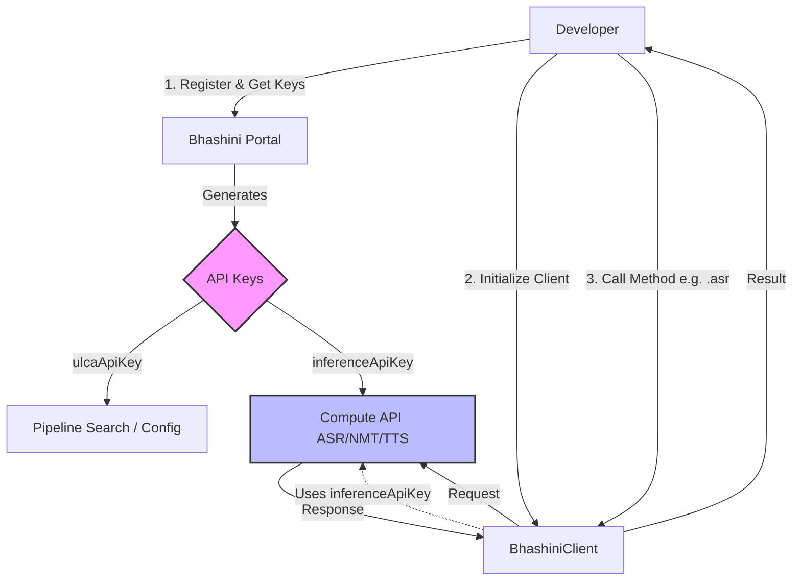

# BHASHINI Client

[](https://badge.fury.io/py/bhashini-client)
[](https://opensource.org/licenses/MIT)

A powerful and easy-to-use Python client for **Bhashini**, India's AI-led language translation platform. This library provides a simple interface to access **Automatic Speech Recognition (ASR)**, **Neural Machine Translation (NMT)**, **Text-to-Speech (TTS)** and **Other Service:**: _(soon to be coming)_

- **OCR, Transliteration**
- **ALD (Automatic Language Detection)**
- **Text Language Detection**
- **Named Entity Recognition**
- **Speaker Diarization**
- **Language Diarization**
- **Speaker Enrollment & Verification**
- **Lip Sync**

> This Bhashini Documentation has been written by Bhashini Team. Please reach out to Bhashini Team on email id [BHASHINI-support](mailto:digitalindiabhashinidivision@gmail.com), if you face issues implementing the APIs.

---

## 🚀 Features

- **ASR (Automatic Speech Recognition)**: Convert audio to text in multiple Indian languages.
- **NMT (Neural Machine Translation)**: Translate text between various Indian languages and English.
- **TTS (Text-to-Speech)**: Convert text to natural-sounding speech.
- **Service Discovery**: Easily list and find available models and services.

## 📦 Installation

Install the package via pip:

```bash
pip install bhashini-client
```

## 🛠 Usage

### Initialization

First, import the client and initialize it with your API key.

```python
from bhashini_client import BhashiniClient

# Initialize with your Bhashini API Key
client = BhashiniClient(api_key="YOUR_API_KEY")
```

> 💡 Click here to get your own [API key](https://dashboard.bhashini.co.in/user/register), sign up for a Bhashini account. [Docs (Read more)](https://dibd-bhashini.gitbook.io/bhashini-apis/pre-requisites-and-onboarding)

---

### 1. Automatic Speech Recognition (ASR)

Automatic Speech Recognition (ASR) enables the conversion of spoken language into written text. This service accepts audio input in formats like WAV, FLAC, or MP3 and processes it to generate accurate text transcriptions. It supports various Indian languages and allows configuration of parameters such as sampling rate and audio format to optimize performance for different environments (e.g., Android, iOS).

#### Parameters

| Parameter        | Type   | Required | Description                                                |
| :--------------- | :----- | :------- | :--------------------------------------------------------- |
| `audio_url`      | `str`  | **Yes**  | Publicly accessible URL of the audio file.                 |
| `source_lang`    | `str`  | **Yes**  | Language code of the audio (e.g., `'hi'`, `'en'`, `'te'`). |
| `serviceId`      | `str`  | No       | Specific model ID to use.                                  |
| `samplingRate`   | `int`  | No       | Sampling rate of the audio (e.g., `16000`, `44100`).       |
| `preProcessors`  | `list` | No       | List of pre-processing steps.                              |
| `postProcessors` | `list` | No       | List of post-processing steps.                             |

#### Example

```python
# Basic ASR
text = client.asr("https://example.com/audio.wav", "te")
print(f"Transcribed Text: {text}")

# Advanced ASR with specific service and sampling rate
text = client.asr(
    "https://example.com/audio.wav",
    "te",
    serviceId="bhashini/ai4bharat/conformer-multilingual-asr",
    samplingRate=44100
)
```

---

### 2. Neural Machine Translation (NMT)

Neural Machine Translation (NMT) facilitates the translation of text from one language to another with high accuracy. It supports a wide range of Indian language pairs and English. The service takes digital text input and returns the translated text, handling nuances and context effectively. It is ideal for breaking language barriers in real-time applications.

#### Parameters

| Parameter        | Type   | Required | Description                                          |
| :--------------- | :----- | :------- | :--------------------------------------------------- |
| `text`           | `str`  | **Yes**  | The text to translate.                               |
| `source_lang`    | `str`  | **Yes**  | Source language code (e.g., `'en'`).                 |
| `target_lang`    | `str`  | **Yes**  | Target language code (e.g., `'hi'`).                 |
| `serviceId`      | `str`  | No       | Specific model ID to use.                            |
| `numTranslation` | `int`  | No       | Number of translations to return.                    |
| `preProcessors`  | `list` | No       | List of pre-processing steps (e.g., `['glossary']`). |
| `postProcessors` | `list` | No       | List of post-processing steps.                       |

#### Example

```python
# Basic NMT: English -> Hindi
translation = client.nmt("Hello, how are you?", "en", "hi")
print(f"Translation: {translation}")

# NMT with processors
translation = client.nmt(
    "What are you doing?",
    "en",
    "hi",
    preProcessors=["glossary"]
)
```

---

### 3. Text-to-Speech (TTS)

Text-to-Speech (TTS) converts digital text into natural-sounding spoken audio. This service allows for customization of the output voice, including gender (male/female) and speech speed (0.5 to 2x). It supports multiple sampling rates to balance audio quality and file size, making it suitable for accessibility features, voice assistants, and content reading.

#### Parameters

| Parameter        | Type    | Required | Description                                                       |
| :--------------- | :------ | :------- | :---------------------------------------------------------------- |
| `text`           | `str`   | **Yes**  | The text to convert to speech.                                    |
| `source_lang`    | `str`   | **Yes**  | Language code of the text.                                        |
| `gender`         | `str`   | No       | Voice gender (`'male'` or `'female'`). Default: `'male'`.         |
| `format_`        | `str`   | No       | Audio format (e.g., `'wav'`, `'mp3'`). Default: `'wav'`.          |
| `save_to`        | `str`   | No       | File path to save the output audio (e.g., `'output.wav'`).        |
| `serviceId`      | `str`   | No       | Specific model ID to use.                                         |
| `speed`          | `float` | No       | Speed of speech (0.1 to 1.99).                                    |
| `samplingRate`   | `int`   | No       | Audio sampling rate (e.g., `24000`).                              |
| `return_base64`  | `bool`  | No       | If `True`, returns base64 string instead of saving/returning URL. |
| `preProcessors`  | `list`  | No       | List of pre-processing steps.                                     |
| `postProcessors` | `list`  | No       | List of post-processing steps.                                    |

#### Example

```python
# Basic TTS - Save to file
audio_path = client.tts("मेरा नाम विहिर है", "hi", save_to="output.wav")
print(f"Audio saved at: {audio_path}")

# TTS with specific gender and speed
client.tts(
    "Hello World",
    "en",
    gender="female",
    speed=0.9,
    save_to="hello_female.wav"
)

# TTS returning base64
base64_audio = client.tts("Hello", "en", return_base64=True)
```

---

### 🔍 Service Discovery

Find available services and models for different languages.

```python
# List NMT models for English to Gujarati
services = client.list_nmt_services("en", "gu")
print(services)

# List ASR models for Hindi
asr_services = client.list_asr_services("hi")

# List TTS models for Hindi
tts_services = client.list_tts_services("hi")

# Get details about a specific service
info = client.get_service_info("ai4bharat/conformer-hi-gpu--t4")
print(info)
```

---

## 🔄 Workflow

Understanding how Bhashini works can help you integrate it better. Here is a high-level workflow for developers:



---

## 🔑 API Keys Explained

Bhashini provides different keys for different purposes. Using the wrong key is a common source of errors.

| Key Name              | Purpose             | When to use?                                                                                               |
| :-------------------- | :------------------ | :--------------------------------------------------------------------------------------------------------- |
| **`ulcaApiKey`**      | **Search & Config** | Used to discover available models and configure pipelines. _This library handles most of this internally._ |
| **`inferenceApiKey`** | **Compute**         | Used to perform the actual tasks (ASR, Translation, TTS). **Use this key to initialize `BhashiniClient`.** |

> ⚠️ **Important**: Always use the `inferenceApiKey` when initializing the `BhashiniClient`.

---

## ❓ Troubleshooting & FAQ

### Common Errors

| Error Code            | Possible Cause       | Solution                                                                                      |
| :-------------------- | :------------------- | :-------------------------------------------------------------------------------------------- |
| **401 Unauthorized**  | Invalid API Key      | Ensure you are using the **`inferenceApiKey`**, not the `ulcaApiKey`. Check for extra spaces. |
| **400 Bad Request**   | Invalid Input        | Check your audio URL (must be public), format (WAV/MP3), or language codes.                   |
| **Service Not Found** | Incorrect Service ID | Use `client.list_nmt_services()` to find valid service IDs for your language pair.            |

### Frequently Asked Questions

**Q: Where do I get the API Key?**  
A: Sign up at the [Bhashini Dashboard](https://dashboard.bhashini.co.in/user/register). Navigate to "My Profile" -> "API Key" to generate your keys.

**Q: Which languages are supported?**  
A: Bhashini supports 22 Indian languages. You can use the `list_supported_languages` method or check the [official documentation](https://bhashini.gov.in/en/).

**Q: Can I use a local audio file?**  
A: Currently, the library requires a **publicly accessible URL** for audio files. You can host your file on S3, Google Drive (direct link), or any public server.

---

## 📄 License

This project is licensed under the MIT License and comes under BHASHINI-DIC
