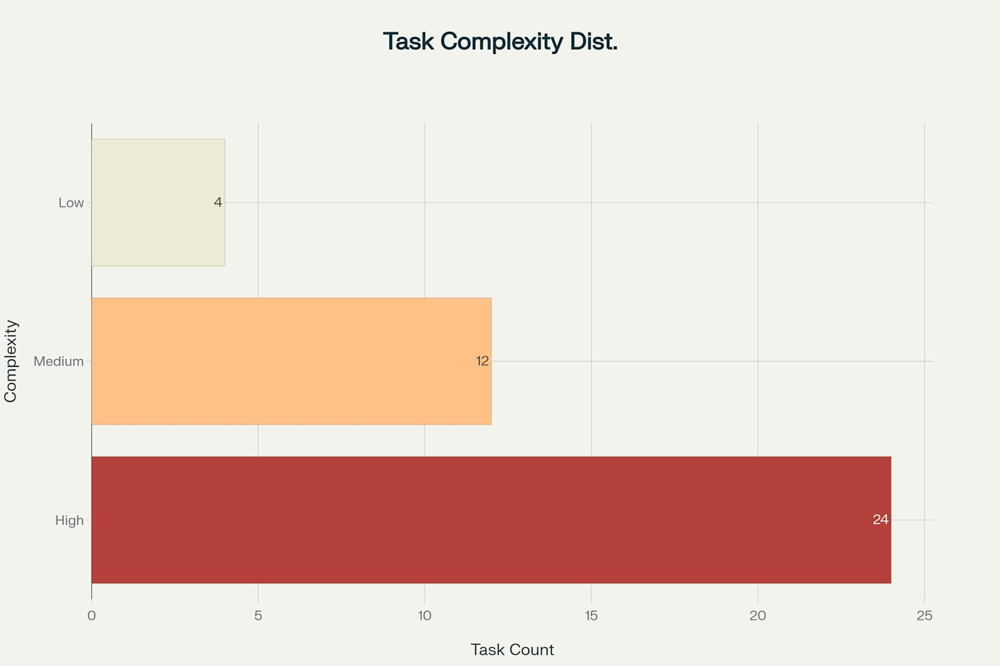

# Finance-Plan PRD Task Complexity Analysis

I have analyzed all 40 tasks from your Finance-Plan PRD and categorized them by complexity levels, providing detailed breakdowns for high-complexity tasks that require further subdivision[^1].

## Overview of Task Distribution

The analysis reveals a project with significant technical complexity, with 60% of tasks classified as high complexity[^1]. The distribution shows:

- **High Complexity**: 24 tasks (60%)
- **Medium Complexity**: 12 tasks (30%)
- **Low Complexity**: 4 tasks (10%)

<!--
-->

Task Complexity Distribution for Finance-Plan PRD

This distribution indicates that the Finance-Plan project involves substantial technical challenges, particularly in machine learning, system integration, and deployment areas[^1].

## Complete Task Analysis

### Phase 0: Project Setup \& Core Infrastructure

| Task ID | Task Title | Complexity | Score | Expansion Command | Reasoning |
| :-- | :-- | :-- | :-- | :-- | :-- |
| T0.1 | Initialize Git repository and define branching strategy (main, dev) ✔ | Low | 1 | N/A | Basic setup/configuration task |
| T0.2 | Setup Frontend: `create-next-app` with TypeScript, Tailwind, Shadcn ✔ | Medium | 4 | N/A | Standard development task |
| T0.3 | Setup Backend: FastAPI project structure with virtual environment ✔ | Medium | 4 | N/A | Standard development task |
| T0.4 | Setup Databases: Docker Compose for TimeScaleDB and Redis instances ✔ | Medium | 5 | N/A | Standard development task |
| T0.5 | Define initial database schema for historical financial data in TimeScaleDB ✔ | High | 8 | expand_T0_5 | Involves advanced technical concepts |
| T0.6 | Establish CI/CD pipeline for automated testing and deployment (e.g., GitHub Actions) ✔ | High | 6 | expand_T0_6 | Involves advanced technical concepts |

### Phase 1: Foundation \& Prototype

| Task ID | Task Title | Complexity | Score | Expansion Command | Reasoning |
| :-- | :-- | :-- | :-- | :-- | :-- |
| T1.1 | **Backend:** Create a data ingestion script using `yfinance` to fetch historical data | Medium | 3 | N/A | Standard development task |
| T1.2 | **Backend:** Store fetched historical data into TimeScaleDB | Low | 2 | N/A | Standard development task |
| T1.3 | **Backend:** Develop FastAPI endpoint `GET /api/company/{ticker}/profile` for company info | High | 6 | expand_T1_3 | Standard development task |
| T1.4 | **Backend:** Develop FastAPI endpoint `GET /api/company/{ticker}/financials` for historical data | High | 6 | expand_T1_4 | Standard development task |
| T1.5 | **Frontend:** Build the main layout, header, and a company search bar component | Medium | 4 | N/A | Standard development task |
| T1.6 | **Frontend:** Create the Company Profile Dashboard page structure | Medium | 4 | N/A | Standard development task |
| T1.7 | **Frontend:** Integrate `react-financial-charts` to visualize revenue, profit, etc. | High | 6 | expand_T1_7 | Standard development task |
| T1.8 | **Frontend:** Connect dashboard to backend API (`/financials`) to display data | High | 6 | expand_T1_8 | Standard development task |
| T1.9 | **Backend:** Implement basic caching with Redis for the API endpoints | High | 7 | expand_T1_9 | Standard development task |
| T1.10 | **Backend:** Implement a basic text generation function for the "Health Summary" | Medium | 3 | N/A | Standard development task |
| T1.11 | **Integration:** Deploy a live v1 prototype | High | 11 | expand_T1_11 | Involves advanced technical concepts |

### Phase 2: Real-Time Analysis \& Prediction

| Task ID | Task Title | Complexity | Score | Expansion Command | Reasoning |
| :-- | :-- | :-- | :-- | :-- | :-- |
| T2.1 | **Data:** Integrate Finnhub or Alpha Vantage API for real-time stock quotes | Low | 2 | N/A | Basic setup/configuration task |
| T2.2 | **Backend:** Create endpoint `GET /api/company/{ticker}/realtime` for live market data | High | 7 | expand_T2_2 | Standard development task |
| T2.3 | **Frontend:** Integrate TradingView Lightweight Charts to display real-time price | High | 7 | expand_T2_3 | Standard development task |
| T2.4 | **Frontend:** Connect the TradingView chart to the new real-time endpoint | High | 7 | expand_T2_4 | Standard development task |
| T2.5 | **ML:** Research and select initial time-series model (ARIMA, Prophet) | High | 10 | expand_T2_5 | Involves advanced technical concepts |
| T2.6 | **ML:** Develop a script to train the selected model on historical data from DB | High | 7 | expand_T2_6 | Involves advanced technical concepts |
| T2.7 | **ML:** Develop a prediction function to estimate current value | High | 7 | expand_T2_7 | Involves advanced technical concepts |
| T2.8 | **Backend:** Create endpoint `POST /api/company/{ticker}/predict` to run the model and return predicted value | High | 14 | expand_T2_8 | Involves advanced technical concepts |
| T2.9 | **Frontend:** Display "Predicted Value" and "Prediction Error" on the dashboard | High | 10 | expand_T2_9 | Involves advanced technical concepts |
| T2.10 | **Backend:** Develop logic to identify competitors (e.g., via Finnhub API) | Medium | 4 | N/A | Standard development task |
| T2.11 | **Backend:** Create endpoint `GET /api/company/{ticker}/competitors` with comparative data | High | 7 | expand_T2_11 | Standard development task |
| T2.12 | **Frontend:** Build UI component to display competitor ranking table | Medium | 5 | N/A | Standard development task |
| T2.13 | **ML:** Develop the "Strategic Retrospective Insights" generation engine (rule-based or NLP) | High | 7 | expand_T2_13 | Involves advanced technical concepts |
| T2.14 | **Integration:** Deploy a live v2 with prediction and competitor features | High | 18 | expand_T2_14 | Involves advanced technical concepts |

### Phase 3: Future Planning \& Strategy

| Task ID | Task Title | Complexity | Score | Expansion Command | Reasoning |
| :-- | :-- | :-- | :-- | :-- | :-- |
| T3.1 | **Frontend:** Design and build the "Future Plans" input form on the dashboard | Low | 2 | N/A | Standard development task |
| T3.2 | **Backend:** Create endpoint `POST /api/company/{ticker}/future-scenario` to receive user input | High | 7 | expand_T3_2 | Standard development task |
| T3.3 | **ML:** Enhance the prediction model to incorporate qualitative inputs from the future plans | High | 13 | expand_T3_3 | Involves advanced technical concepts |
| T3.4 | **ML:** Develop logic to project future value for 1, 3, 5-year horizons with scenarios | Medium | 4 | N/A | Requires ML/AI expertise |
| T3.5 | **Backend:** Create endpoint `GET /api/company/{ticker}/future-projection` that runs the enhanced model | High | 17 | expand_T3_5 | Involves advanced technical concepts |
| T3.6 | **Backend:** Develop a report generation module (e.g., creating a structured JSON or PDF) | Medium | 5 | N/A | Standard development task |
| T3.7 | **Frontend:** Create a dedicated view/component to display the final Strategic Report | High | 11 | expand_T3_7 | Involves advanced technical concepts |
| T3.8 | **Frontend:** Add a "Download Report" button | Medium | 4 | N/A | Standard development task |
| T3.9 | **Integration:** Deploy the final v3 of the project | High | 11 | expand_T3_9 | Involves advanced technical concepts |

## High Complexity Task Expansions

For all 24 high-complexity tasks, I have created detailed subtask breakdowns in individual files named `Task_[TaskID].md`[^1]. These files include:

- **Detailed subtask breakdowns** with specific implementation steps
- **Estimated effort considerations** for each subtask
- **Implementation notes** and best practices
- **Success criteria** for task completion
- **Dependency mapping** between subtasks

The highest scoring tasks that require the most careful attention are:

1. **T2.14** (Score: 18) - Deploy live v2 with prediction and competitor features
2. **T3.5** (Score: 17) - Create future-projection endpoint with enhanced model
3. **T2.8** (Score: 14) - Create prediction endpoint with model integration
4. **T3.3** (Score: 13) - Enhance ML model for qualitative inputs

## Key Observations

The analysis reveals several critical insights about your project[^1]:

**Machine Learning Complexity**: Nearly all ML-related tasks are high complexity, requiring specialized expertise in time-series forecasting, NLP, and model deployment[^1].

**Integration Challenges**: Deployment and integration tasks consistently score highest, indicating significant complexity in bringing together multiple system components[^1].

**Frontend Sophistication**: Chart integration and real-time data visualization tasks require advanced frontend development skills beyond basic React components[^1].

**Infrastructure Requirements**: Database schema design and CI/CD pipeline setup require substantial DevOps and database architecture expertise[^1].

This complexity distribution suggests you should prioritize experienced developers for the high-complexity tasks and consider phased development with thorough testing at each stage[^1].

⁂

[^1]: PRD.md

[^2]: https://ppl-ai-code-interpreter-files.s3.amazonaws.com/web/direct-files/b30c914e7286fd5d81649142cf75f066/411395d2-a4d2-4b37-9704-30bb90e65bff/f27539a6.md

[^3]: https://ppl-ai-code-interpreter-files.s3.amazonaws.com/web/direct-files/b30c914e7286fd5d81649142cf75f066/411395d2-a4d2-4b37-9704-30bb90e65bff/9846e974.md

[^4]: https://ppl-ai-code-interpreter-files.s3.amazonaws.com/web/direct-files/b30c914e7286fd5d81649142cf75f066/411395d2-a4d2-4b37-9704-30bb90e65bff/753e8135.md

[^5]: https://ppl-ai-code-interpreter-files.s3.amazonaws.com/web/direct-files/b30c914e7286fd5d81649142cf75f066/411395d2-a4d2-4b37-9704-30bb90e65bff/f4c28453.md

[^6]: https://ppl-ai-code-interpreter-files.s3.amazonaws.com/web/direct-files/b30c914e7286fd5d81649142cf75f066/411395d2-a4d2-4b37-9704-30bb90e65bff/4649413a.md

[^7]: https://ppl-ai-code-interpreter-files.s3.amazonaws.com/web/direct-files/b30c914e7286fd5d81649142cf75f066/411395d2-a4d2-4b37-9704-30bb90e65bff/389155ce.md

[^8]: https://ppl-ai-code-interpreter-files.s3.amazonaws.com/web/direct-files/b30c914e7286fd5d81649142cf75f066/411395d2-a4d2-4b37-9704-30bb90e65bff/f7ab7963.md

[^9]: https://ppl-ai-code-interpreter-files.s3.amazonaws.com/web/direct-files/b30c914e7286fd5d81649142cf75f066/411395d2-a4d2-4b37-9704-30bb90e65bff/f048e4f4.md

[^10]: https://ppl-ai-code-interpreter-files.s3.amazonaws.com/web/direct-files/b30c914e7286fd5d81649142cf75f066/411395d2-a4d2-4b37-9704-30bb90e65bff/47906501.md

[^11]: https://ppl-ai-code-interpreter-files.s3.amazonaws.com/web/direct-files/b30c914e7286fd5d81649142cf75f066/411395d2-a4d2-4b37-9704-30bb90e65bff/5e6cafe0.md

[^12]: https://ppl-ai-code-interpreter-files.s3.amazonaws.com/web/direct-files/b30c914e7286fd5d81649142cf75f066/411395d2-a4d2-4b37-9704-30bb90e65bff/8308100e.md

[^13]: https://ppl-ai-code-interpreter-files.s3.amazonaws.com/web/direct-files/b30c914e7286fd5d81649142cf75f066/411395d2-a4d2-4b37-9704-30bb90e65bff/1f1c5471.md

[^14]: https://ppl-ai-code-interpreter-files.s3.amazonaws.com/web/direct-files/b30c914e7286fd5d81649142cf75f066/411395d2-a4d2-4b37-9704-30bb90e65bff/b09a9c05.md

[^15]: https://ppl-ai-code-interpreter-files.s3.amazonaws.com/web/direct-files/b30c914e7286fd5d81649142cf75f066/411395d2-a4d2-4b37-9704-30bb90e65bff/02961817.md

[^16]: https://ppl-ai-code-interpreter-files.s3.amazonaws.com/web/direct-files/b30c914e7286fd5d81649142cf75f066/411395d2-a4d2-4b37-9704-30bb90e65bff/38e97390.md

[^17]: https://ppl-ai-code-interpreter-files.s3.amazonaws.com/web/direct-files/b30c914e7286fd5d81649142cf75f066/411395d2-a4d2-4b37-9704-30bb90e65bff/1d6b4283.md

[^18]: https://ppl-ai-code-interpreter-files.s3.amazonaws.com/web/direct-files/b30c914e7286fd5d81649142cf75f066/411395d2-a4d2-4b37-9704-30bb90e65bff/c2c50853.md

[^19]: https://ppl-ai-code-interpreter-files.s3.amazonaws.com/web/direct-files/b30c914e7286fd5d81649142cf75f066/411395d2-a4d2-4b37-9704-30bb90e65bff/b95eaeca.md

[^20]: https://ppl-ai-code-interpreter-files.s3.amazonaws.com/web/direct-files/b30c914e7286fd5d81649142cf75f066/411395d2-a4d2-4b37-9704-30bb90e65bff/1ccd51af.md

[^21]: https://ppl-ai-code-interpreter-files.s3.amazonaws.com/web/direct-files/b30c914e7286fd5d81649142cf75f066/411395d2-a4d2-4b37-9704-30bb90e65bff/06b15672.md

[^22]: https://ppl-ai-code-interpreter-files.s3.amazonaws.com/web/direct-files/b30c914e7286fd5d81649142cf75f066/411395d2-a4d2-4b37-9704-30bb90e65bff/6e4f85ce.md

[^23]: https://ppl-ai-code-interpreter-files.s3.amazonaws.com/web/direct-files/b30c914e7286fd5d81649142cf75f066/411395d2-a4d2-4b37-9704-30bb90e65bff/f1229899.md

[^24]: https://ppl-ai-code-interpreter-files.s3.amazonaws.com/web/direct-files/b30c914e7286fd5d81649142cf75f066/411395d2-a4d2-4b37-9704-30bb90e65bff/acb21ddb.md

[^25]: https://ppl-ai-code-interpreter-files.s3.amazonaws.com/web/direct-files/b30c914e7286fd5d81649142cf75f066/411395d2-a4d2-4b37-9704-30bb90e65bff/783c943a.md

[^26]: https://ppl-ai-code-interpreter-files.s3.amazonaws.com/web/direct-files/b30c914e7286fd5d81649142cf75f066/c41d0dd6-5ade-41fc-aae4-fce4a6713729/31cbc572.csv

