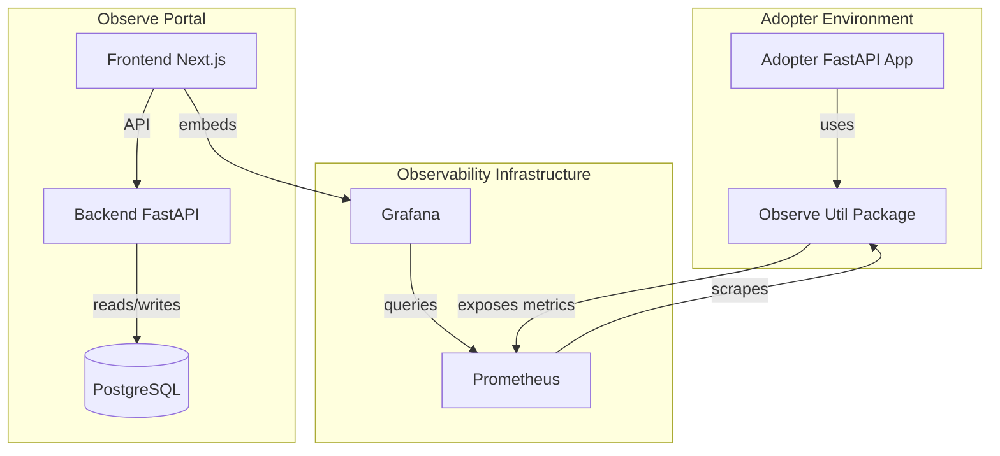

# Project Analysis Report: Observe Building Block v1.0

## 1. Introduction

This report analyzes the "Observe Building Block" release v1.0 based on the provided email from Shailndra sir and the accompanying source code repositories (`observe-util`, `observe-metrics/client`, `observe-metrics/backend`).

The objective is to verify the claims made in the release announcement, explain the high-level architecture, and document the current state of development to assist in understanding "what is going on".

## 2. Executive Summary

**Bottom Line:** The codebase strongly aligns with the release announcement. The project consists of two main independent components: a **Portal** for management/visualization and a **Utility** package for collecting metrics from Python/FastAPI services.

- **Status**: The code appears to be feature-complete for v1.0 as described.
- **Architecture**: Modular and multi-tenant by design.
- **Key Verification**: The "10+ built-in metrics" claimed in the mail are present and implemented in the code, covering specific NLP domains (NMT, ASR, TTS, etc.).

## 3. High-Level Architecture

The solution maps to a standard observability stack with a custom data collection layer and a custom administration portal.

### Core Components

1.  **Observe Util (Data Plane)**: A Python library installed in your actual applications (e.g., the Bhashini/Dhruva services). It automatically intercepts requests and calculates metrics.
2.  **Observe Portal (Control Plane)**: A standalone web application for managing users, teams, and organizations. It likely embeds or links to Grafana dashboards for visualization.

## 4. Mail vs. Codebase Comparison

The following table compares specific claims found in the mail with the evidence found in the codebase.

| Claim in Mail                                                           | Evidence in Codebase                                                                                                                    | Status      |
| :---------------------------------------------------------------------- | :-------------------------------------------------------------------------------------------------------------------------------------- | :---------- |
| **Two Repositories**: Observe Portal & Observe Util                     | **Confirmed**. `observe-metrics` contains the Portal (Client/Backend), `observe-util` is the Util package.                              | ✅ Verified |
| **Portal Stack**: Next.js (Frontend) + FastAPI (Backend) + PostgreSQL   | **Confirmed**. `client/package.json` shows Next.js 15. `backend/requirements.txt` show FastAPI & SQLAlchemy/Postgres.                   | ✅ Verified |
| **Util Features**: Plug-and-play, Multi-tenant metrics isolation        | **Confirmed**. `observe-util/observe/middleware.py` handles tenant extraction and isolation.                                            | ✅ Verified |
| **Metrics Count**: "10+ built-in metrics"                               | **Confirmed**. `metrics.py` defines ~20 specific metrics (Cpu, Memory, Requests, NMT, TTS, OCR, etc.).                                  | ✅ Verified |
| **Specific Business Metrics**: NMT, ASR, TTS, Characters, Audio Seconds | **Confirmed**. Wrappers for `telemetry_obsv_nmt_characters_translated`, `telemetry_obsv_asr_audio_seconds_processed`, etc. are present. | ✅ Verified |
| **Portal Auth**: Adopter authentication, Captcha, JWT                   | **Confirmed**. The backend has specific endpoints for `/v1/captcha`, `/v1/signin`, and uses JWT tokens.                                 | ✅ Verified |
| **Portal UI**: Admin dashboards, folders, teams                         | **Confirmed**. The Next.js app structure (`app/`, `components/`) contains views for organizations, teams, and dashboards.               | ✅ Verified |

## 5. Detailed Component status

### A. Observe Util (`observe-util`)

- **Purpose**: The "SDK" you install in your services.
- **Key Code**:
  - `metrics.py`: Defines the Prometheus collectors. It goes beyond generic HTTP metrics to include domain-specific concepts like "Table/Image OCR", "Speaker Diarization", and "LLM tokens".
  - `middleware.py`: The "automatic" part. It listens to every HTTP request, captures duration, status codes, and implicitly captures the tenant ID to ensure data isolation.
- **Documentation**: Good README explaining typical usage.

### B. Observe Portal - Client (`observe-metrics/client`)

- **Purpose**: The User Interface for managers/admins.
- **Tech**: Very modern stack (Next.js 15, Tailwind, Shadcn/Radix UI).
- **Features**:
  - Login/Signup flows.
  - Organization & Team management screens.
  - Integration points for Grafana dashboards (likely iframe or proxy).

### C. Observe Portal - Backend (`observe-metrics/backend`)

- **Purpose**: The engine behind the Portal UI.
- **Tech**: FastAPI with Async SQLAlchemy.
- **Features**:
  - **Auth**: Custom auth system with Captcha generation/validation.
  - **Database**: `services/auth_service.py` and `models/user.py` handle the business logic for users and organizations.
  - **API**: RESTful structure (`api/v1/auth.py`).

## 6. What they have done till now

The team has delivered a **functioning v1.0 foundation**.

1.  **Backend Logic**: Fully implemented metric collection for complex AI/ML workflows (ASR/TTS/etc). This is the most critical part for Bhashini's specific needs.
2.  **Frontend/Portal**: A modern web application is set up with authentication and structure.
3.  **Infrastructure**: They have Docker/Database setup scripts (`init_db.py`, `setup_db.py`).
4.  **Testing**: The mail mentions a "Observability Test Suite" and "Validation Sheet". While I haven't run these, the presence of `test-cases/` directory and scripts like `test-basic-auth.sh` in the codebase supports this.

## 7. Notes for Management (Shailndra Sir)

- **Readiness**: The code looks solid and structured. It separates concerns well (Util vs. Portal).
- **Integration**: The key for "L1/L2/L3 customers" (metrics isolation) is handled by the `observe-util` middleware, which tags every metric with an `organization` label. This allows you to slice and dice data per customer in Grafana.
- **Action Items**:
  - Deployment: The repositories include `run.sh` and Docker-related configs (implied by typical Python structures, though Dockerfiles weren't explicitly listed in the root, setup scripts are there).
  - Configuration: You will need to configure the specific Prometheus targets to scrape these new endpoints.

**Conclusion**: The release appears to be exactly what was promised: a modular, multi-tenant capable observability layer tailored for the Dhruva platform's specific AI workloads.
